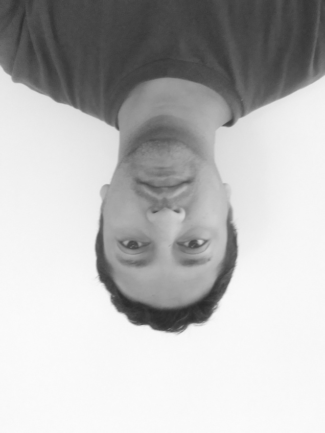
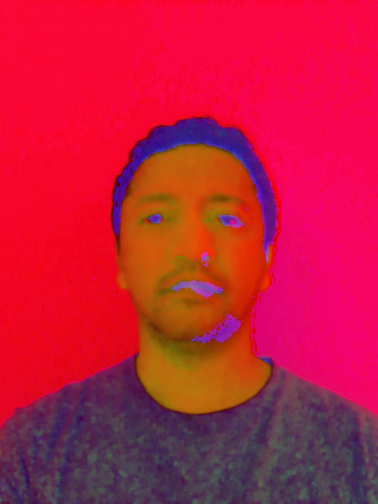

# Part 1 (Color & Gray Scale image | Transformations)

 - Converting a color image to grayscale using OpenCV
 - Doing some transformations/changes with both the color & gray versions
 - Creating a Gaussian pyramid of the image and displaying it as a single image.
   What is the space requirement for the pyramid?
   What is the size of the smallest rectangular image needed to pack the pyramid.

   code: part1.py

Results
-------
https://hasanmansur.github.io/drishtipat/part1/

<!DOCTYPE html>
<html>
<head>
<meta name="viewport" content="width=device-width, initial-scale=1">

<title>S M Hasan Mansur</title>
</head>
<body>

  <h1>Part1</h1>

<h2>Problem 1: BGR and GRAYSCALE</h2>

  

    <h2>original color image</h2>
    
  

  

    <h2>GRAY SCALE image</h2>
    
  

<h2>Problem 2: Transformations</h2>

  

    <h2>Translation: Color image translated Right & Down</h2>
    
  

  

    <h2>Rotation: Color image rotated 270 degree</h2>
    
  

  

    <h2>Reflection: Gray scale image reflected vertically</h2>
    
  

  

    <h2>Color space change: BGR to HSV</h2>
    
  

  

    <h2>Shearing: Gray scale image sheared horizontally</h2>
    
  

  

    <h2>Blurring: Color image blurred</h2>
    
  

  

    <h2>Resizing: Color image resized to double</h2>
    
  

  

  

<h2>Problem 3:  Gaussian pyramid</h2>

  

    <h2> Gaussian pyramid</h2>
    
Dislay gaussian pyramid in a single image

    
  

  

  

</body>
</html>
