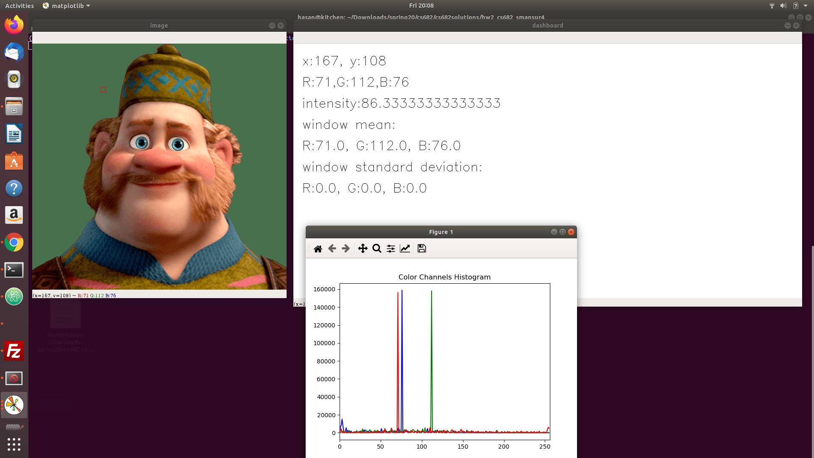
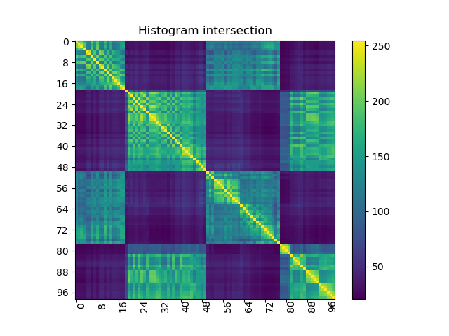
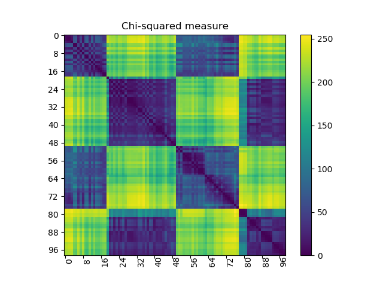

# Part 2 ( Windowing | Mean, Standard Deviation | Color Histograms | Histogram Comparison )

 1. Implementing the following exercise from the book "Concise Computer Vision"

    

    code: prob_1.py

 2. For this part we will use the images from ST2MainHall4 folder.

   - Building color histograms for all images in the folder 'ST2MainHall4'. Color histogram should be
   512-bin: [(r/32) ∗ 64 + (g/32) ∗ 8 + b/32] will convert a color value into an index. To be noted that
   all divisions are integer divisions as in C programming language. That means that they can be accomplished using bit shifts.

   - Writing two functions for histograms comparison: histogram intersection and chisquared measure.
     - Histogram intersection. Given two color histograms H1(·) and H2(·) their intersection is given by

       

       Large values correspond to high similarity.

     - Chi-squared measure(χ2): Given two histograms H1 and H2 the χ2 measure of their similarity is given by

       

       Small values correspond to high similarity.

   - Comparing all image pairs with the use of histogram comparison functions.

   code: prob_2.py

Results
-------

<!DOCTYPE html>
<html>
<head>
<meta name="viewport" content="width=device-width, initial-scale=1">
</head>
<body>

<h2>Problem 1:</h2>

  
Following image shows:

  <ul>
  <li>Loading & displaying a .png image</li>
  <li>Histograms of three color channels</li>
  <li>A separate dashboard image showing realtime info of:
      <ul>
      <li>Coordinates (x,y) of the reference point (p) </li>
      <li>RGB values at p</li>
      <li>Intensity value at p</li>
      <li>Mean and standard deviation of the window(Wp).</li>
    </ul>
  </li>
  </ul>
  

<h2>Problem 2:</h2>

  
Following image shows the histogram intersection, where large values correspond to high similarity(as depicted by the diagonal)

  

  
Following image shows the chi square measure, where small values correspond to high similarity(as depicted by the diagonal)

  

</body>
</html>
