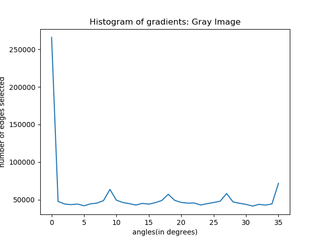
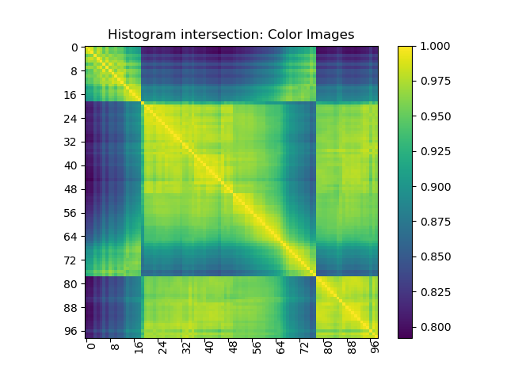
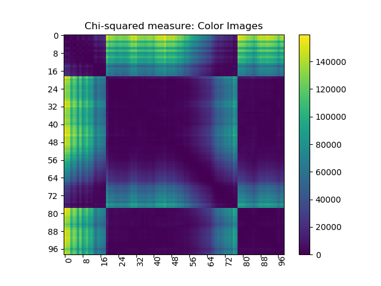

# Part 3 (Gradients | Edge Detection | Edge histograms | Histogram Comparison)

There are several stages to this task:

1. Computing the gray-level edges and color edges for the images in the folder ST2MainHall4.
   We can use Canny edge detector to select edge points (includes smoothing, derivative computation, hysteresis thresholding and non-maximum suppression).
   To be noted that for the next step we need the gradients of the selected points. To compute the color gradients we should split the images into r, g, b fields and compute
   rx, gx, bx, ry, gy, by components of the gradients using the same process we used for the gray images. Note that it may be appropriate to use lower threshold for the gradients of the color
   planes than those used for the gray images.

2. Building gray edge histograms for all images in the sequence. Edge histograms should be 36-bin: we can turn a gradient angle into in index by dividing the orientation angle by 10
   and rounding to the nearest integer. We should decide whether we want to use the edge magnitude in the histograms or count all selected edges using the same value, say 1.

3. To build color edge histograms we should use the gradients computed for all three color planes. We can use the vector U = (rx + gx + bx, ry + gy + by) to determine edge orientation
   and its magnitude m. Note that we can proceed to build the color histograms using U,m pairs computed for all image points. We may also threshold the remaining points to remove too small values of m.

4. Writing two functions for histograms comparison: histogram intersection and chisquared measure.
     - Histogram intersection. Given two color histograms H1(·) and H2(·) their intersection is given by

       

       Large values correspond to high similarity.

     - Chi-squared measure(χ2): Given two histograms H1 and H2 the χ2 measure of their similarity is given by

       

       Small values correspond to high similarity.

5. Comparing all edge histogram pairs with the use of histogram comparison functions.

Code: prob12345.py

Results
-------
https://hasanmansur.github.io/drishtipat/part3/

<!DOCTYPE html>
<html>
<head>
<meta name="viewport" content="width=device-width, initial-scale=1">
</head>
<body>

<h2>Problem 1,2,3,4,5:</h2>

  
Following image shows the output of Canny edge detection operation on a sample gray image (ST2MainHall4001.jpg)

  
Threshold used: mivVal: 100, maxVal:200

  
  <!--
Following image shows the output of Canny edge detection operation on a sample color image (ST2MainHall4001.jpg)

  -->

  
Following image shows the histogram of gradients of a sample gray image (ST2MainHall4001.jpg)

  

  
Following image shows the histogram of gradients of a sample color image (ST2MainHall4001.jpg)

  

  
Following image shows the histogram intersection of gray edge histograms,

  
where large values correspond to high similarity(as depicted by the diagonal)

  

  
Following image shows the chi square measure of gray edge histograms,

  
where small values correspond to high similarity(as depicted by the diagonal)

  

  
Following image shows the histogram intersection of color edge histograms

  
where large values correspond to high similarity(as depicted by the diagonal)

  

  
Following image shows the chi square measure of color edge histograms

  
where small values correspond to high similarity(as depicted by the diagonal)

  

</body>
</html>
