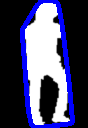
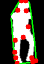
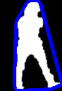
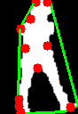
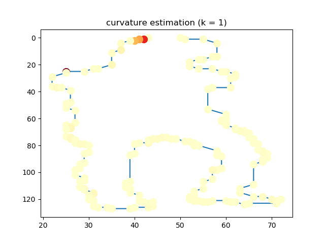
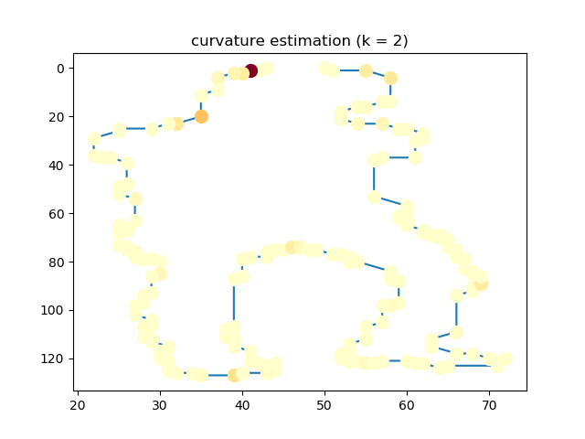
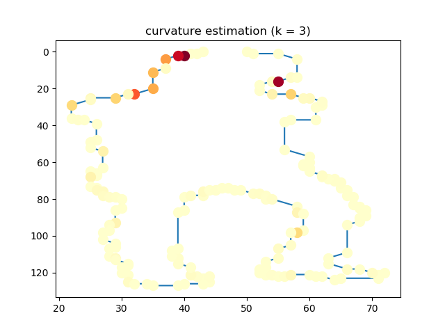
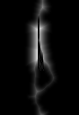
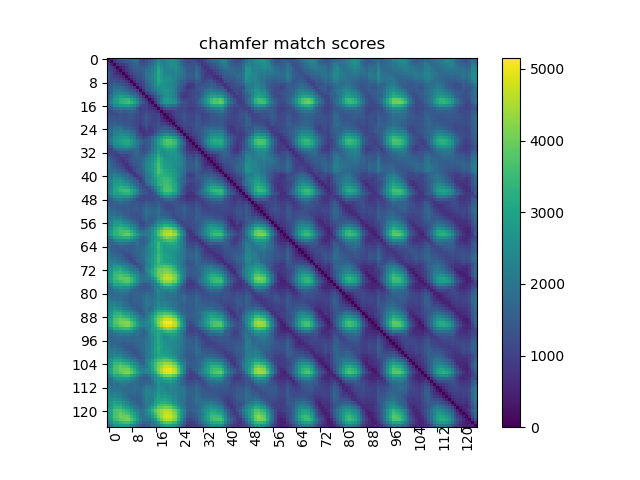
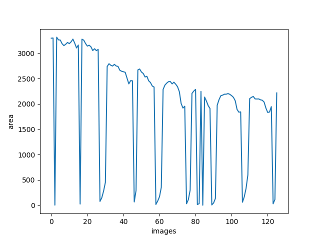

# Part 4 (Feature Extraction | Curvature & Distance Transform computation | Chamfer matching)

The binary images in the GaitImages folder are images of a moving person imaged from a side. The task is to apply a variety of algorithms for feature
extraction and image recognition to these images. There are several stages to this task:

1.
   - Finding and displaying image boundaries/contours.
   - Finding polygonal approximation of computed boundaries and computing convex hull and the deficits of convexity for the shapes.
   - Computing area, perimeter and all first and second order image moments for the original image and for the convex hull.
   - Illustrating the process of feature calculation on two different image and displaying the contour with marked polygonal approximation and the convex hull.

   code: p12.py

2.
   - Creating a table with computed values for all frames
   - Displaying the computed features. For deficits of convexity computing the number and their total area.

   code: p12.py

3.
   - Given an image boundary, implementing the method from the book "Concise Computer Vision" to compute curvature along the boundary.
   - Using color coding to display computed values in an image. The color scheme should be used to display curvature with higher curvature values represented by
     ‘hotter’ colors.
   - Experimenting with the window size (−k; +k) to determine what works well for curvature estimation.

   code: p3.py

4. Given a silhouette boundary its distance transform corresponds to distances of nonboundary pixels to nearest boundary point.
   - Using  Euclidean distance transform to compute distance transform for all boundaries. The algorithm is described in the book "Concise Computer Vision".
   - Displaying at least two files to show the computed distance transform results.

   code: p4.py

5. Chamfer matching is a technique used for matching (possibly noisy) image boundaries.
   - Implementing chamfer matching and using it to match all pairs of gait images in the provided sequence.

   code: p5.py

6. Analysis of the results in steps 2 and 5.
   - (a) Is there periodicity and how it shows in results (parts 2 & 5)?
   - (b) Two most distinct phases of gait correspond to the widest and the narrowest profiles. Can we detect them from features displayed in 2.
   - (c) Could we use curvature to detect joints and segment body parts? How?

Results
-------

<!DOCTYPE html>
<html>
<head>
<meta name="viewport" content="width=device-width, initial-scale=1">
</head>
<body>

<h2>Problem 1</h2>

Following images show countours, polygonal approximation, convex hull, convexity defects for two sample images: 00000048.png and 00000051.png.
Computed values for area, perimeter, first & second order moments, number of convexity deficits and their total area are provided in the section Problelm 2

  
contour(00000048.png)

  

  
polygonal approximation(00000048.png)

  

  
convex hull(00000048.png)

  

  
convexity defects(00000048.png)

  

  
contour(00000051.png)

  

  
polygonal approximation(00000051.png)

  

  
convex hull(00000051.png)

  

  
convexity defects(00000051.png)

  

<h2>Problem 2</h2>

Below table shows computed values for area, perimeter, first & second order moments,
   number of convexity deficits and their total area. Though I have computed the values for all 126 images,
   here I am providing the values for some of them (image: 00000051.png to 00000094.png)

<pre>
  ------------------------------------------00000051.png----------------------------------------------------------------
  (original image) --> m10: 145389.17 | m01: 204798.33 | m20: 7011323.67 | m11 9148993.0 | m02: 16286636.17 | area: 3319.0 | perimeter: 471.71
  (convex hull)    --> m10: 296022.67 | m01: 445626.83 | m20: 15810322.0 | m11 22032309.33 | m02: 39307662.83 | area: 6140.0 | perimeter: 333.7
  convexity deficits--> number: 11 | total area: 2350.5
  ------------------------------------------00000052.png----------------------------------------------------------------
  (original image) --> m10: 143041.83 | m01: 202910.83 | m20: 6953186.17 | m11 9039433.42 | m02: 16256432.5 | area: 3266.0 | perimeter: 482.33
  (convex hull)    --> m10: 304936.0 | m01: 466750.83 | m20: 16298828.75 | m11 22776050.21 | m02: 41426691.75 | area: 6371.5 | perimeter: 336.77
  convexity deficits--> number: 12 | total area: 2528.0
  ------------------------------------------00000053.png----------------------------------------------------------------
  (original image) --> m10: 141559.17 | m01: 206116.17 | m20: 6851301.83 | m11 9079272.42 | m02: 16672443.83 | area: 3262.0 | perimeter: 488.19
  (convex hull)    --> m10: 302151.83 | m01: 482991.33 | m20: 15951045.92 | m11 22918050.54 | m02: 43363507.42 | area: 6463.5 | perimeter: 340.66
  convexity deficits--> number: 12 | total area: 2658.5
  ------------------------------------------00000054.png----------------------------------------------------------------
  (original image) --> m10: 138222.17 | m01: 202761.33 | m20: 6661633.83 | m11 8861190.92 | m02: 16421410.33 | area: 3190.0 | perimeter: 480.33
  (convex hull)    --> m10: 285969.83 | m01: 480052.83 | m20: 14605575.67 | m11 21634787.67 | m02: 43286346.33 | area: 6370.0 | perimeter: 339.72
  convexity deficits--> number: 11 | total area: 2738.5
  ------------------------------------------00000055.png----------------------------------------------------------------
  (original image) --> m10: 136948.67 | m01: 200125.17 | m20: 6581429.25 | m11 8708121.96 | m02: 16220524.42 | area: 3152.5 | perimeter: 478.43
  (convex hull)    --> m10: 268314.5 | m01: 466714.67 | m20: 13270593.58 | m11 20189689.21 | m02: 42259984.42 | area: 6176.5 | perimeter: 339.86
  convexity deficits--> number: 11 | total area: 2740.5
  ------------------------------------------00000056.png----------------------------------------------------------------
  (original image) --> m10: 138216.0 | m01: 202317.5 | m20: 6600514.42 | m11 8743096.46 | m02: 16467746.58 | area: 3179.5 | perimeter: 472.29
  (convex hull)    --> m10: 251665.5 | m01: 448967.5 | m20: 12066175.58 | m11 18682620.79 | m02: 40520860.58 | area: 5974.5 | perimeter: 336.32
  convexity deficits--> number: 10 | total area: 2595.5
  ------------------------------------------00000057.png----------------------------------------------------------------
  (original image) --> m10: 139938.67 | m01: 202869.33 | m20: 6617417.5 | m11 8746330.67 | m02: 16500871.5 | area: 3215.0 | perimeter: 474.05
  (convex hull)    --> m10: 242540.17 | m01: 433896.0 | m20: 11376702.92 | m11 17627210.79 | m02: 38942914.08 | area: 5858.5 | perimeter: 333.73
  convexity deficits--> number: 13 | total area: 2561.0
  ------------------------------------------00000058.png----------------------------------------------------------------
  (original image) --> m10: 138809.67 | m01: 200449.17 | m20: 6457488.67 | m11 8634903.83 | m02: 16205529.5 | area: 3192.0 | perimeter: 462.25
  (convex hull)    --> m10: 225785.17 | m01: 397619.83 | m20: 10358525.75 | m11 16051511.88 | m02: 35225743.25 | area: 5484.5 | perimeter: 326.14
  convexity deficits--> number: 11 | total area: 2517.0
  ------------------------------------------00000059.png----------------------------------------------------------------
  (original image) --> m10: 140824.33 | m01: 199564.67 | m20: 6503172.67 | m11 8614668.08 | m02: 15986966.33 | area: 3228.0 | perimeter: 428.25
  (convex hull)    --> m10: 213932.67 | m01: 363587.5 | m20: 9702187.92 | m11 14818302.71 | m02: 31661518.75 | area: 5164.5 | perimeter: 317.29
  convexity deficits--> number: 13 | total area: 2022.0
  ------------------------------------------00000060.png----------------------------------------------------------------
  (original image) --> m10: 144026.5 | m01: 198221.33 | m20: 6653445.0 | m11 8617555.67 | m02: 15558351.5 | area: 3281.0 | perimeter: 421.91
  (convex hull)    --> m10: 214606.33 | m01: 343665.33 | m20: 9939713.5 | m11 14555498.67 | m02: 29322569.83 | area: 5006.0 | perimeter: 309.51
  convexity deficits--> number: 12 | total area: 1785.0
  ------------------------------------------00000061.png----------------------------------------------------------------
  (original image) --> m10: 138932.5 | m01: 187528.17 | m20: 6342378.33 | m11 8031676.33 | m02: 14468510.0 | area: 3201.0 | perimeter: 445.71
  (convex hull)    --> m10: 226038.83 | m01: 331672.5 | m20: 10925812.67 | m11 14792300.75 | m02: 27442596.83 | area: 5022.0 | perimeter: 304.36
  convexity deficits--> number: 11 | total area: 1873.5
  ------------------------------------------00000062.png----------------------------------------------------------------
  (original image) --> m10: 133821.0 | m01: 175752.5 | m20: 6075417.25 | m11 7547771.21 | m02: 13087203.42 | area: 3106.5 | perimeter: 420.98
  (convex hull)    --> m10: 231172.17 | m01: 312696.67 | m20: 11575281.58 | m11 14600046.62 | m02: 24787112.92 | area: 4953.5 | perimeter: 299.61
  convexity deficits--> number: 11 | total area: 1770.0
  ------------------------------------------00000063.png----------------------------------------------------------------
  (original image) --> m10: 135851.83 | m01: 182524.0 | m20: 6165566.83 | m11 7813644.25 | m02: 13718606.0 | area: 3164.0 | perimeter: 433.02
  (convex hull)    --> m10: 242706.83 | m01: 324209.5 | m20: 12354359.33 | m11 15141592.58 | m02: 25412190.5 | area: 5164.0 | perimeter: 303.73
  convexity deficits--> number: 13 | total area: 2118.0
  ------------------------------------------00000064.png----------------------------------------------------------------
  (original image) --> m10: 966.83 | m01: 2733.83 | m20: 39803.58 | m11 112457.46 | m02: 318123.92 | area: 23.5 | perimeter: 19.9
  (convex hull)    --> m10: 986.67 | m01: 2791.33 | m20: 40590.33 | m11 114738.25 | m02: 324736.5 | area: 24.0 | perimeter: 19.72
  convexity deficits--> number: 1 | total area: 0.5
  ------------------------------------------00000065.png----------------------------------------------------------------
  (original image) --> m10: 139956.5 | m01: 200699.33 | m20: 6396667.0 | m11 8553955.5 | m02: 15971418.17 | area: 3279.0 | perimeter: 571.3
  (convex hull)    --> m10: 304717.83 | m01: 423745.5 | m20: 16372393.0 | m11 20459063.0 | m02: 35049490.67 | area: 6283.0 | perimeter: 322.3
  convexity deficits--> number: 11 | total area: 2936.0
  ------------------------------------------00000066.png----------------------------------------------------------------
  (original image) --> m10: 138694.33 | m01: 201509.5 | m20: 6392771.58 | m11 8559624.96 | m02: 16113952.08 | area: 3260.5 | perimeter: 569.2
  (convex hull)    --> m10: 330627.0 | m01: 464386.0 | m20: 18266127.5 | m11 22907264.08 | m02: 39152325.67 | area: 6688.0 | perimeter: 328.06
  convexity deficits--> number: 14 | total area: 2896.0
  ------------------------------------------00000067.png----------------------------------------------------------------
  (original image) --> m10: 136455.67 | m01: 195369.83 | m20: 6349839.25 | m11 8329149.38 | m02: 15480000.42 | area: 3194.5 | perimeter: 578.66
  (convex hull)    --> m10: 344380.5 | m01: 488896.5 | m20: 19304531.83 | m11 24313048.33 | m02: 41668120.83 | area: 6915.0 | perimeter: 331.6
  convexity deficits--> number: 13 | total area: 2686.0
  ------------------------------------------00000068.png----------------------------------------------------------------
  (original image) --> m10: 134201.33 | m01: 194655.5 | m20: 6263488.83 | m11 8234830.25 | m02: 15478958.33 | area: 3143.0 | perimeter: 567.93
  (convex hull)    --> m10: 346666.0 | m01: 495151.33 | m20: 19508977.08 | m11 24512276.29 | m02: 42349546.08 | area: 6957.5 | perimeter: 332.73
  convexity deficits--> number: 12 | total area: 2790.5
  ------------------------------------------00000069.png----------------------------------------------------------------
  (original image) --> m10: 135029.5 | m01: 195452.17 | m20: 6316182.08 | m11 8246608.71 | m02: 15508589.75 | area: 3160.5 | perimeter: 567.14
  (convex hull)    --> m10: 342350.67 | m01: 499801.33 | m20: 19068549.58 | m11 24274233.12 | m02: 43021183.75 | area: 6967.5 | perimeter: 333.51
  convexity deficits--> number: 14 | total area: 2850.0
  ------------------------------------------00000070.png----------------------------------------------------------------
  (original image) --> m10: 133527.5 | m01: 194593.17 | m20: 6218893.33 | m11 8180981.42 | m02: 15467059.67 | area: 3129.0 | perimeter: 555.59
  (convex hull)    --> m10: 332195.17 | m01: 492553.0 | m20: 18282339.33 | m11 23573089.25 | m02: 42466475.5 | area: 6845.0 | perimeter: 332.72
  convexity deficits--> number: 11 | total area: 2830.0
  ------------------------------------------00000071.png----------------------------------------------------------------
  (original image) --> m10: 131697.67 | m01: 187097.83 | m20: 6127037.17 | m11 7959497.92 | m02: 14785866.0 | area: 3055.0 | perimeter: 550.07
  (convex hull)    --> m10: 316524.83 | m01: 474276.17 | m20: 17037044.17 | m11 22307133.0 | m02: 40820857.17 | area: 6634.0 | perimeter: 330.46
  convexity deficits--> number: 12 | total area: 3118.0
  ------------------------------------------00000072.png----------------------------------------------------------------
  (original image) --> m10: 133749.0 | m01: 188624.33 | m20: 6189425.5 | m11 8046785.5 | m02: 14778895.17 | area: 3091.0 | perimeter: 520.96
  (convex hull)    --> m10: 290016.83 | m01: 435172.67 | m20: 15206727.0 | m11 20271444.92 | m02: 37312436.33 | area: 6141.0 | perimeter: 322.79
  convexity deficits--> number: 12 | total area: 2775.0
  ------------------------------------------00000073.png----------------------------------------------------------------
  (original image) --> m10: 132691.17 | m01: 185407.33 | m20: 6079750.0 | m11 7985170.42 | m02: 14445660.17 | area: 3053.0 | perimeter: 475.02
  (convex hull)    --> m10: 255586.5 | m01: 378145.0 | m20: 13016860.08 | m11 17598906.12 | m02: 32036905.58 | area: 5448.5 | perimeter: 312.72
  convexity deficits--> number: 12 | total area: 1982.5
  ------------------------------------------00000074.png----------------------------------------------------------------
  (original image) --> m10: 134779.83 | m01: 187821.0 | m20: 6160667.42 | m11 8175939.38 | m02: 14608922.25 | area: 3078.5 | perimeter: 432.63
  (convex hull)    --> m10: 223545.0 | m01: 325388.0 | m20: 11041109.58 | m11 15020566.29 | m02: 27130354.75 | area: 4826.5 | perimeter: 301.3
  convexity deficits--> number: 11 | total area: 1377.0
  ------------------------------------------00000075.png----------------------------------------------------------------
  (original image) --> m10: 3589.67 | m01: 6411.33 | m20: 173257.25 | m11 308991.88 | m02: 552521.58 | area: 74.5 | perimeter: 35.56
  (convex hull)    --> m10: 3666.67 | m01: 6537.83 | m20: 177213.0 | m11 315489.67 | m02: 563195.5 | area: 76.0 | perimeter: 34.72
  convexity deficits--> number: 2 | total area: 3.5
  ------------------------------------------00000076.png----------------------------------------------------------------
  (original image) --> m10: 7017.83 | m01: 12589.33 | m20: 337324.75 | m11 603077.04 | m02: 1084959.92 | area: 146.5 | perimeter: 50.87
  (convex hull)    --> m10: 7444.67 | m01: 13355.0 | m20: 357708.42 | m11 639430.29 | m02: 1150273.25 | area: 155.5 | perimeter: 49.65
  convexity deficits--> number: 4 | total area: 9.0
  ------------------------------------------00000077.png----------------------------------------------------------------
  (original image) --> m10: 13064.5 | m01: 24711.5 | m20: 616840.75 | m11 1156523.38 | m02: 2206653.75 | area: 278.5 | perimeter: 77.36
  (convex hull)    --> m10: 14188.33 | m01: 26852.0 | m20: 670054.42 | m11 1256597.12 | m02: 2399069.42 | area: 302.5 | perimeter: 74.06
  convexity deficits--> number: 6 | total area: 24.5
  ------------------------------------------00000078.png----------------------------------------------------------------
  (original image) --> m10: 20770.5 | m01: 42076.67 | m20: 965848.67 | m11 1928741.83 | m02: 3968988.83 | area: 451.0 | perimeter: 100.43
  (convex hull)    --> m10: 23051.67 | m01: 46917.33 | m20: 1069755.5 | m11 2145367.08 | m02: 4432183.33 | area: 502.0 | perimeter: 94.58
  convexity deficits--> number: 9 | total area: 51.5
  ------------------------------------------00000079.png----------------------------------------------------------------
  (original image) --> m10: 118488.17 | m01: 170481.0 | m20: 5389176.5 | m11 7394839.67 | m02: 13759076.67 | area: 2740.0 | perimeter: 457.42
  (convex hull)    --> m10: 192260.33 | m01: 289843.0 | m20: 9140625.08 | m11 13178967.96 | m02: 24822559.75 | area: 4250.5 | perimeter: 305.77
  convexity deficits--> number: 9 | total area: 1349.5
  ------------------------------------------00000080.png----------------------------------------------------------------
  (original image) --> m10: 120718.67 | m01: 176215.33 | m20: 5554756.83 | m11 7657837.5 | m02: 14328161.17 | area: 2795.0 | perimeter: 450.11
  (convex hull)    --> m10: 223307.17 | m01: 343038.5 | m20: 11045098.67 | m11 16056451.33 | m02: 29997398.5 | area: 4823.0 | perimeter: 314.85
  convexity deficits--> number: 9 | total area: 1728.5
  ------------------------------------------00000081.png----------------------------------------------------------------
  (original image) --> m10: 119057.33 | m01: 176470.67 | m20: 5554280.25 | m11 7688177.71 | m02: 14448914.58 | area: 2764.5 | perimeter: 455.32
  (convex hull)    --> m10: 255449.33 | m01: 392905.67 | m20: 13161968.25 | m11 18885828.79 | m02: 34774129.58 | area: 5382.5 | perimeter: 323.52
  convexity deficits--> number: 11 | total area: 1959.5
  ------------------------------------------00000082.png----------------------------------------------------------------
  (original image) --> m10: 117976.83 | m01: 177471.83 | m20: 5559467.25 | m11 7652990.88 | m02: 14587749.25 | area: 2749.5 | perimeter: 456.63
  (convex hull)    --> m10: 275620.67 | m01: 428120.17 | m20: 14508371.0 | m11 20612255.67 | m02: 38139756.0 | area: 5767.0 | perimeter: 329.19
  convexity deficits--> number: 12 | total area: 2203.0
  ------------------------------------------00000083.png----------------------------------------------------------------
  (original image) --> m10: 119540.17 | m01: 183192.17 | m20: 5723020.75 | m11 7934201.38 | m02: 15272377.42 | area: 2782.5 | perimeter: 471.26
  (convex hull)    --> m10: 291353.17 | m01: 463634.17 | m20: 15531316.83 | m11 22229230.5 | m02: 41840762.67 | area: 6107.0 | perimeter: 334.96
  convexity deficits--> number: 10 | total area: 2554.0
  ------------------------------------------00000084.png----------------------------------------------------------------
  (original image) --> m10: 117899.17 | m01: 181421.67 | m20: 5630676.83 | m11 7765424.0 | m02: 15136377.67 | area: 2750.0 | perimeter: 472.68
  (convex hull)    --> m10: 280006.67 | m01: 466242.33 | m20: 14539585.92 | m11 21393300.96 | m02: 42344469.75 | area: 6081.5 | perimeter: 336.85
  convexity deficits--> number: 10 | total area: 2699.0
  ------------------------------------------00000085.png----------------------------------------------------------------
  (original image) --> m10: 117842.67 | m01: 181818.83 | m20: 5637720.08 | m11 7763055.88 | m02: 15228658.92 | area: 2741.5 | perimeter: 468.09
  (convex hull)    --> m10: 267369.5 | m01: 463922.5 | m20: 13506908.17 | m11 20385046.17 | m02: 42312888.83 | area: 6017.0 | perimeter: 338.24
  convexity deficits--> number: 10 | total area: 2788.0
  ------------------------------------------00000086.png----------------------------------------------------------------
  (original image) --> m10: 115716.0 | m01: 175781.5 | m20: 5546531.25 | m11 7543091.79 | m02: 14651553.42 | area: 2666.5 | perimeter: 472.43
  (convex hull)    --> m10: 254212.67 | m01: 457042.33 | m20: 12480856.58 | m11 19208649.71 | m02: 41728580.25 | area: 5925.5 | perimeter: 338.56
  convexity deficits--> number: 10 | total area: 2797.5
  ------------------------------------------00000087.png----------------------------------------------------------------
  (original image) --> m10: 114726.0 | m01: 175293.0 | m20: 5455870.67 | m11 7452709.17 | m02: 14736189.67 | area: 2646.0 | perimeter: 465.02
  (convex hull)    --> m10: 236516.0 | m01: 435838.0 | m20: 11233886.5 | m11 17663593.33 | m02: 39666041.33 | area: 5679.0 | perimeter: 333.5
  convexity deficits--> number: 11 | total area: 2734.0
  ------------------------------------------00000088.png----------------------------------------------------------------
  (original image) --> m10: 114169.33 | m01: 173653.83 | m20: 5337293.5 | m11 7350154.67 | m02: 14550234.33 | area: 2637.0 | perimeter: 460.39
  (convex hull)    --> m10: 222234.5 | m01: 405831.83 | m20: 10344007.17 | m11 16279479.67 | m02: 36623585.83 | area: 5377.0 | perimeter: 329.72
  convexity deficits--> number: 12 | total area: 2542.0
  ------------------------------------------00000089.png----------------------------------------------------------------
  (original image) --> m10: 113999.0 | m01: 171131.17 | m20: 5244704.17 | m11 7300785.5 | m02: 14310328.33 | area: 2625.0 | perimeter: 422.25
  (convex hull)    --> m10: 206846.5 | m01: 366461.33 | m20: 9436538.75 | m11 14723807.04 | m02: 32451391.08 | area: 5005.5 | perimeter: 318.78
  convexity deficits--> number: 9 | total area: 2154.0
  ------------------------------------------00000090.png----------------------------------------------------------------
  (original image) --> m10: 108388.33 | m01: 159727.0 | m20: 4887459.67 | m11 6770306.75 | m02: 13299163.0 | area: 2510.0 | perimeter: 411.62
  (convex hull)    --> m10: 185556.67 | m01: 321641.67 | m20: 8273317.92 | m11 12949184.71 | m02: 28246814.58 | area: 4489.5 | perimeter: 310.76
  convexity deficits--> number: 10 | total area: 1936.0
  ------------------------------------------00000091.png----------------------------------------------------------------
  (original image) --> m10: 102942.0 | m01: 148201.5 | m20: 4572795.83 | m11 6236499.0 | m02: 12177183.33 | area: 2397.0 | perimeter: 400.59
  (convex hull)    --> m10: 167245.83 | m01: 282139.83 | m20: 7316655.58 | m11 11347570.04 | m02: 24406246.58 | area: 4055.5 | perimeter: 301.87
  convexity deficits--> number: 9 | total area: 1783.0
  ------------------------------------------00000092.png----------------------------------------------------------------
  (original image) --> m10: 107186.67 | m01: 150638.67 | m20: 4805110.25 | m11 6447818.46 | m02: 12191989.58 | area: 2460.5 | perimeter: 401.52
  (convex hull)    --> m10: 176756.0 | m01: 269970.5 | m20: 8129692.75 | m11 11591717.21 | m02: 22582819.25 | area: 4039.5 | perimeter: 292.98
  convexity deficits--> number: 12 | total area: 1441.5
  ------------------------------------------00000093.png----------------------------------------------------------------
  (original image) --> m10: 107417.33 | m01: 147321.83 | m20: 4827071.33 | m11 6373822.08 | m02: 11555162.83 | area: 2458.0 | perimeter: 387.08
  (convex hull)    --> m10: 179751.5 | m01: 248465.0 | m20: 8652698.58 | m11 11306562.96 | m02: 19980971.75 | area: 3902.5 | perimeter: 290.43
  convexity deficits--> number: 8 | total area: 1476.5
  ------------------------------------------00000094.png----------------------------------------------------------------
  (original image) --> m10: 3045.83 | m01: 5929.67 | m20: 144127.42 | m11 279649.71 | m02: 546012.58 | area: 64.5 | perimeter: 38.04
  (convex hull)    --> m10: 3416.17 | m01: 6663.67 | m20: 161309.08 | m11 313631.88 | m02: 613398.92 | area: 72.5 | perimeter: 36.74
  convexity deficits--> number: 3 | total area: 8.5
</pre>

<h2>Problem 3</h2>

Following images show curvature estimation using different window sizes: k = 1, k = 2, k = 3  (sample image: 00000048.png)

  

  

  

For curvature estimation, as shown above, I have experimented with different window sizes (using k=1, k=2, k=3).

My observation is k=3 (window size 7) works better for curvature estimation because it better approximates both global & local maxima.

<h2>Problem 4</h2>

Following images show the Euclidean distance transform results for sample images: 00000048.png, 00000051.png, 00000058.png, 00000076.png.
For computing distance transform, I implemented the Euclidean distance transform algorithm given in the textbook (Concise Computer Vision, page 112).
Later I also computed the same thing using the OpenCV implementation (cv.distanceTransform) of this algorithm. Both provide the same result.

  

  

  

  

<h2>Problem 5</h2>

Following image shows the chamfer matching scores result for all pairs of gait images

  

<h2>Problem 6</h2>

<b>
(6a)
</b>

We observe periodicity in both the results from part 2 & part 5, which means some frames are similar to others.

In part 5, if we look into the chamfer match scores result image, we observe the periodicity along the diagonals. We also observe periodicity along x axis
  & y axis.

In part 2, for example, if we plot the area values (y axis) of all the images (x axis), it will show the periodicity. Following image depicts this:

<b>
(6b)
</b>

Two most distinct phases of gait correspond to the widest and the narrowest profiles. We can detect this from the values of area.

If we look into the above plot 'images vs area' in 6a, we notice that area values change between high & low values in a periodic manner.

This clearly depicts the correspondence to the widest and the narrowest profiles.

<b>
(6c)
</b>

We can use curvature to detect joints and segment body parts.

If we look into the image of curvature estimation using k=3  in Problem3, we notice higher curvature values along shoulder, neck, head, chin etc.

We can use this information to segment the whole body into two parts, where the upper part holds higher cuvature values.

