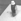

# Part 5 (Stereo Matching | Disparity | Depth Image | Belief Propagation)

You are given a pair of small stereo images (21 × 21). You can assume that the stereo
cameras were in a canonical position with f = 20mm (500 pixels) for both cameras and the
baseline b = 20cm.

